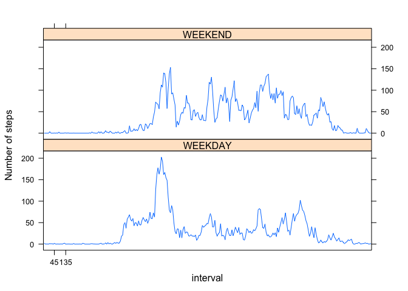

# Reproducible Research: Peer Assessment 1


## Loading and preprocessing the data

```r
d <- read.csv("activity.csv")
total_steps_by_day <- tapply(d$steps, d$date, sum, na.rm = T)
mean_steps_by_day <- tapply(d$steps, d$date, mean, na.rm = T)
mean_steps_by_interval <- tapply(d$steps, d$interval, mean, na.rm = T)
```

## What is mean total number of steps taken per day?


```r
hist(total_steps_by_day)
```

 

```r
cat("mean = ", as.character(mean(total_steps_by_day)))
```

```
## mean =  9354.22950819672
```

```r
cat("median = ", median(total_steps_by_day))
```

```
## median =  10395
```

## What is the average daily activity pattern?


```r
plot(mean_steps_by_interval, type = "l")
```

 

```r
cat("Max steps are for ", names(mean_steps_by_interval)[which.max(mean_steps_by_interval)])
```

```
## Max steps are for  835
```

## Imputing missing values


```r
cat("Number of missing values = ", sum(is.na(d$steps)))
```

```
## Number of missing values =  2304
```

```r
d2 <- d
d2$steps <- ifelse(is.na(d$steps), mean_steps_by_day[d$date], d$steps)
d2$steps <- ifelse(is.nan(d2$steps), 0, d2$steps)
total_steps_by_day_2 <- tapply(d2$steps, d2$date, sum)
hist(total_steps_by_day_2)
```

 
Substituting NAs with day mean does not have an impact on the total number of steps by day because NAs appear togther for the whole day or don't appear for a day at all.

## Are there differences in activity patterns between weekdays and weekends?


```r
d2$week <- ifelse(weekdays(strptime(d2$date, "%Y-%m-%d")) %in% c("Sunday", "Saturday"), "WEEKEND", "WEEKDAY")
t2 <- as.data.frame(as.table(tapply(d2$steps, list(d2$interval, d2$week), mean)))
names(t2) <- c("interval", "week", "mean_steps")
library(lattice)
xyplot(t2$mean_steps ~ t2$interval | t2$week, type = "l", layout = c(1, 2), ylab = "Number of steps", xlab = "interval", scales=list(x=list(at = c(10, 20))))
```

 
